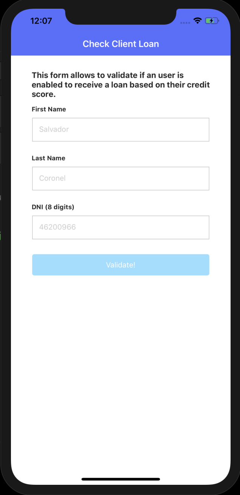
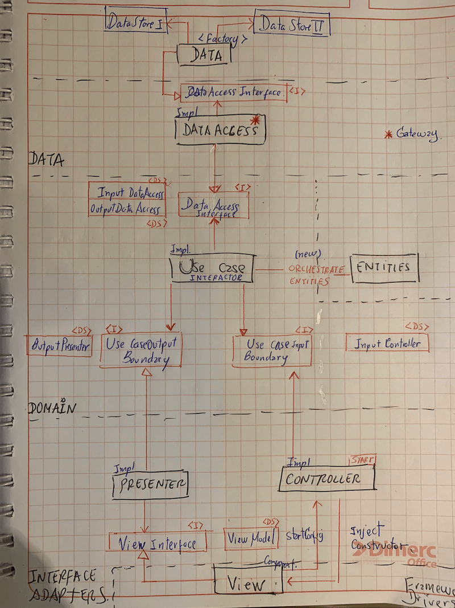

# NativeScript Clean Arquitecture

## Demo App

If you want a quickstart, clone the repo, then:

```javascript
$ git clone https://github.com/salvadorcoronel/nativescript-clean-arquitecture.git
$ cd nativescript-clean-arquitecture
$ tns run android/iOS --bundle
```



## Clean Arquitecture

This is an implementation of the clean architecture principles in a NativeScript project.
In this code you can see how we totally separate the Uses Cases and Entities, from the View and data in Memory, local device or from an API.

You can see how we communicate between layers following the Dependency Rule and how we transform data sources that moving between layers to avoid dependence on the Use Cases of any external element of our application.


